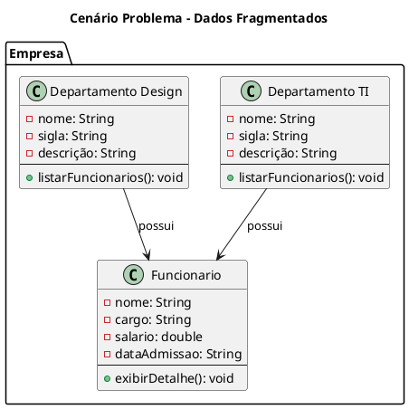
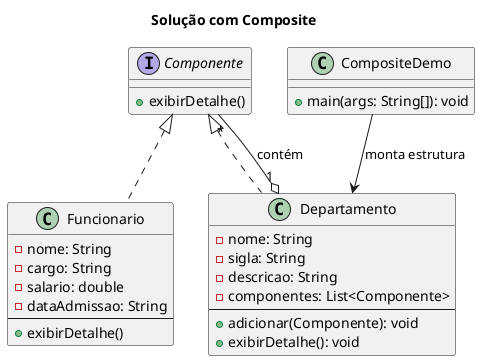

# Composite

## Motivação
Imagine que uma empresa deseja organizar e exibir a estrutura hierárquica de sua organização, que inclui departamentos e funcionários. Atualmente, os dados são armazenados de forma separada (listas de funcionários e departamentos independentes) e não há uma maneira simples e uniforme de exibir essa hierarquia.

#### Problema:

Fragmentação dos dados: Cada departamento possui sua própria lista de funcionários e, em alguns casos, também pode conter subdepartamentos. Sem uma estrutura unificada, a exibição e manutenção dos dados se torna complexa.
Dificuldade na exibição hierárquica: Para exibir a estrutura completa da empresa, seria necessário iterar manualmente por cada nível hierárquico e combinar informações de diferentes fontes.
Manutenção custosa: Qualquer modificação na estrutura hierárquica ou na forma de exibir os dados demandaria a alteração de diversas partes do código.

  



#### Como o Composite Resolve o Problema:

Utilizando o padrão Composite, cria-se uma estrutura hierárquica onde tanto departamentos (composite) quanto funcionários (leaf) implementam a mesma interface (no exemplo, Componente com o método exibirDetalhe()). Dessa forma, a exibição da estrutura completa é feita de maneira recursiva e uniforme, simplificando a manutenção e a escalabilidade do sistema.




### Estrutura 


### Participantes

- **Component (Componente)**
  -  declara a interface para os objetos na composição;
  -  implementa comportamento-padrão para a interface comum a todas as
classes, conforme apropriado;
  -  declara uma interface para acessar e gerenciar os seus componentes-filhos;
  -  (opcional) define uma interface para acessar o pai de um componente na
estrutura recursiva e a implementa, se isso for apropriado.
- **Leaf (Funcionário)**
  - representa objetos-folha na composição. Uma folha não tem filhos;
  - define comportamento para objetos primitivos na composição.
- **Composite (Departamento)**
  - define comportamento para componentes que têm filhos;
  - armazena os componentes-filho;
  - implementa as operações relacionadas com os filhos presentes na interface de Component.
- **Client (CompositeDemo)**
  - manipula objetos na composição através da interface de Component.

### Exemplo: 

####  Interface Componente - Component

```java
public interface Componente {
    void exibirDetalhe();
}
```

####  Funcionario - Leaf
```java 

public class Funcionario implements Componente {
    String nome;
    String cargo;
    double salario;
    String dataAdmissao;

    public Funcionario(String nome, String cargo, double salario, String dataAdmissao) {
        this.nome = nome;
        this.cargo = cargo;
        this.salario = salario;
        this.dataAdmissao = dataAdmissao;
    }

    @Override
    public void exibirDetalhe() {
        System.out.printf("Nome: %s, Cargo: %s, Salário: %.2f, Data de Admissão: %s\n", 
                        nome, cargo, salario, dataAdmissao);
    }

    
}
```

####  Classe Departamento - Composite
```java
import java.util.ArrayList;
import java.util.List;

public class Departamento implements Componente {
    String nome;
    String sigla;
    String descricao;
    private List<Componente> componentes = new ArrayList<>();

    public Departamento(String nome, String sigla, String descricao) {
        this.nome = nome;
        this.sigla = sigla;
        this.descricao = descricao;
    }

    public void adicionar(Componente componente) {
        componentes.add(componente);
    }
    

    @Override
    public void exibirDetalhe() {

        System.out.println("Departamento: " + nome);
        System.out.println("Sigla: " + sigla);
        System.out.println("Descrição: " + descricao);
    
        for (Componente componente : componentes) {
            componente.exibirDetalhe();
        }
    }
    
}

```

#### Classe CompositeDemo - Client 

```java
public class CompositeDemo {
    public static void main(String[] args) {
        // Cria alguns funcionários (folhas)
        Funcionario func1 = new Funcionario("Ana", "Analista de Sistemas",1500, "01/01/2010");
        Funcionario func2 = new Funcionario("Bruno", "Desenvolvedor", 3500, "01/01/2015");
        Funcionario func3 = new Funcionario("Carlos", "Designer", 2000, "01/01/2012");

        // Cria um departamento de TI e adiciona funcionários
        Departamento deptTI = new Departamento("Tecnologia Da Informação", "TI", "Departamento de TI");
        deptTI.adicionar(func1);
        deptTI.adicionar(func2);

        // Cria um departamento de Design e adiciona um funcionário
        Departamento deptDesign = new Departamento("Comunicação Visual", "CV", "Departamento de Design");
        deptDesign.adicionar(func3);

        // Cria um departamento principal que agrupa os subdepartamentos
        Departamento empresa = new Departamento("Empresa Falsa","EF", "Empresa não existente" );
        empresa.adicionar(deptTI);
        empresa.adicionar(deptDesign);

        // Exibe a estrutura completa da empresa
        empresa.exibirDetalhe();
    }
}


```
